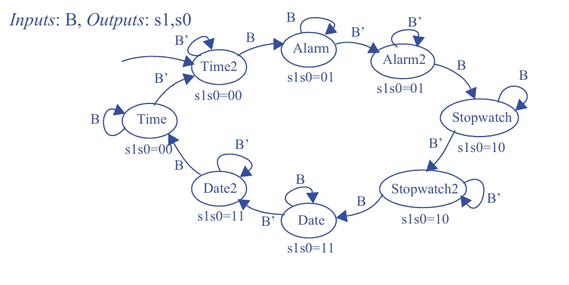

## Seção 3.3: Máquinas de Estados Finitos (FSMs) e Blocos de Controle

### Questão 3.27

O mostrador de um relógio de pulso pode fornecer uma de quatro informações: hora atual, alarme, cronômetro e data, que são controladas por dois sinais s1 e s0 (00 exibe a hora atual, 01, a do alarme, 10, a do cronômetro e 11, a data – assuma que s1s0 controla um multiplexador de N bits de largura que deixa passar os dados do registrador apropriado). Quando se pressiona um botão B (o que faz B=1), o próximo item da sequência será exibido (se, no momento, o item mostrado for a data, o próximo será a hora atual). Crie um diagrama de estados para uma FSM que descreva esse comportamento de forma sequencial. A FSM terá um bit de entrada B e dois bits de saída, s1 e s0. Sempre que o botão for pressionado, assegure-se de que ocorrerá o avanço de apenas um item, independentemente de quanto tempo o botão permanece pressionado; isto é, depois de ter avançado para o próximo item dentro da sequência, espere primeiro que o botão seja solto. Use nomes curtos mas sugestivos para cada estado. Faça com que a exibição da hora atual seja o estado inicial.

---

### Objetivo

Projetar o mostrador de um relógio de pulso com quatro funções (Hora, Alarme, Cronômetro, Data), controladas por dois sinais de saída (s1, s0).

**Entrada:**  
Um botão B (B=1 se pressionado, B=0 se solto).

**Saídas:**  
s1 e s0.

**Mapeamento das Saídas:**

- s1s0 = 00: Hora  
- s1s0 = 01: Alarme  
- s1s0 = 10: Cronômetro  
- s1s0 = 11: Data  

**Comportamento:**  
Pressionar B avança para a próxima função no ciclo:  
Hora → Alarme → Cronômetro → Data → Hora...

**Restrição Principal:**  
A FSM deve avançar apenas um item por clique, não importa quanto tempo o botão fique pressionado. É preciso esperar que o botão seja solto antes de permitir um novo avanço.

**Estado Inicial:**  
Hora (s1s0 = 00).

---

### Diagrama de Estados

---

### Explicação da Resposta (O Diagrama de Estados)

explicando passo a passo como se chega a essa resposta.

---

### Passo 1: Entendendo o Desafio Principal

A restrição mais importante é a de "avançar apenas um item por clique". Se fosse usado apenas 4 estados (um para cada função), o que aconteceria? Se o usuário segurasse o botão B pressionado (B=1), a máquina de estados pularia de Hora para Alarme, para Cronômetro, etc., muito rapidamente, sem parar.

Para evitar isso, o design precisa distinguir entre o ato de pressionar o botão e o de soltar o botão.

---

### Passo 2: A Solução - Oito Estados em vez de Quatro

A solução genial no diagrama é usar dois estados para cada função, criando um total de 8 estados. Cada par de estados tem uma função específica:

**Um estado de "Acabei de Chegar / Esperando Soltar" (ex: Alarm, Stopwatch):**

- A FSM entra neste estado assim que o botão B é pressionado para mudar de função.  
- A principal tarefa deste estado é esperar. Enquanto o botão continuar pressionado (B=1), a FSM fica parada neste estado.  
- Ela só avança para o próximo estado quando o botão é finalmente solto (B=0).

**Um estado "Estável / Esperando Pressionar" (ex: Alarm2, Stopwatch2):**

- A FSM entra neste estado depois que o usuário soltou o botão.  
- Este é o estado de "repouso" para cada função. A FSM fica aqui, mostrando a função correta, enquanto o botão não está pressionado (B=0).  
- É somente a partir deste estado que um novo clique (B=1) fará a FSM avançar para a próxima função.

---

### Passo 3: Analisando o Fluxo no Diagrama

Vamos seguir o ciclo a partir da função "Alarme" para ver a lógica em ação:

- **Estamos em Alarm2:**  
  O relógio mostra "Alarme" e espera. O usuário não está tocando no botão (B=0). Se continuar assim, a FSM fica em um loop em Alarm2.

- **Usuário Pressiona B:**  
  A entrada se torna B=1. O diagrama mostra uma transição de Alarm2 para Stopwatch. A FSM avança para a próxima função e as saídas mudam para s1s0=10.

- **Estamos em Stopwatch:**  
  O relógio agora mostra "Cronômetro". Se o usuário continuar segurando o botão (B=1), a FSM fica em um loop no estado Stopwatch. Ela não avança mais, cumprindo a restrição do problema.

- **Usuário Solta B:**  
  A entrada se torna B=0. O diagrama mostra uma transição de Stopwatch para Stopwatch2. A saída não muda (s1s0 continua 10).

- **Estamos em Stopwatch2:**  
  O relógio continua mostrando "Cronômetro". A FSM agora está pronta e esperando um novo clique para avançar para a função "Data".

---

Este padrão (Estado principal 2 → Próximo Estado 1 → Próximo Estado 2) se repete para todo o ciclo, garantindo que cada clique no botão B resulte em apenas um avanço de função. O diagrama na imagem implementa essa lógica perfeitamente.
