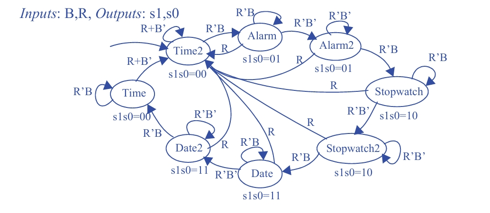

### Questão 3.28

Expanda o diagrama de estados criado no Exercício 3.27 acrescentando uma entrada **R**.  
Quando **R = 1**, a FSM deve ser forçada a voltar ao estado que exibe a **hora atual**, independentemente do estado em que se encontrava ou do valor da entrada **B**.

---

## Objetivo

- **Acrescentar uma nova entrada:** `R` (Reset).  
- **Definir um novo comportamento:**  
  Quando `R = 1`, a máquina de estados (FSM) deve retornar imediatamente ao estado que exibe a hora atual.

---

## Diagrama de Estados

---

## Etapa 1: Definindo o Estado de Destino do Reset

A primeira decisão de projeto é escolher para qual dos estados relacionados à função **Hora** o reset deve levar a FSM.  
Na máquina original, existem dois estados associados à hora (por exemplo, `Time` e `Time2`).

O estado mais adequado para ser o destino do reset é o estado **estável** (ou de repouso), pois ele representa a condição normal de operação, aguardando uma nova ação do usuário.

➡️ No diagrama adotado, o estado escolhido foi **Time2**.  
Todas as transições de reset apontam para esse estado, que passa a ser o **estado de referência inicial** da FSM.

---

## Etapa 2: A Lógica do Reset – Prioridade Máxima

Um sinal de reset deve ter **prioridade absoluta** sobre qualquer outro comportamento da máquina.

### Regra Fundamental
- Se `R = 1`, a FSM **sempre** transiciona para o estado `Time2`.

### Implementação no Diagrama
- Desenha-se uma transição saindo de **todos os outros estados**  
  (`Time`, `Alarm`, `Alarm2`, `Stopwatch`, `Stopwatch2`, `Date`, `Date2`)  
  apontando para `Time2`.
- A condição associada a essas transições é simplesmente `R`.

Isso cria uma espécie de **“rota de fuga”**, permitindo que a FSM volte ao estado inicial a partir de qualquer ponto do diagrama.

---

## Etapa 3: Modificando as Transições Originais

Quando o reset **não** está ativo (`R = 0`), a FSM deve se comportar exatamente como no exercício anterior, respondendo normalmente ao botão **B**.

Para garantir isso, todas as transições originais devem ser **protegidas** pela condição `R'` (reset inativo).

### Exemplo: Estado `Stopwatch2`

**No diagrama original:**
- Transição para `Date` com condição `B`.
- Loop em `Stopwatch2` com condição `B'`.

**No novo diagrama (com reset):**
- Transição para `Date` com condição `R'B`.
- Loop em `Stopwatch2` com condição `R'B'`.
- Nova transição para `Time2` com condição `R`.

Essas três transições:
- `R`
- `R'B`
- `R'B'`

cobrem **todas as possibilidades** de entrada para o estado `Stopwatch2`.

---

## Conclusão

O diagrama final é obtido aplicando sistematicamente duas modificações ao diagrama do Exercício 3.27:

1. **Adicionar transições de reset:**  
   Criar, a partir de todos os estados, uma transição para `Time2` condicionada a `R = 1`.

2. **Proteger as transições existentes:**  
   Acrescentar a condição `R'` a todas as transições que dependem de `B` ou `B'`.

Com isso, obtém-se uma máquina de estados robusta, que:
- Funciona normalmente quando `R = 0`;
- Retorna de forma imediata e confiável ao estado inicial quando `R = 1`.
