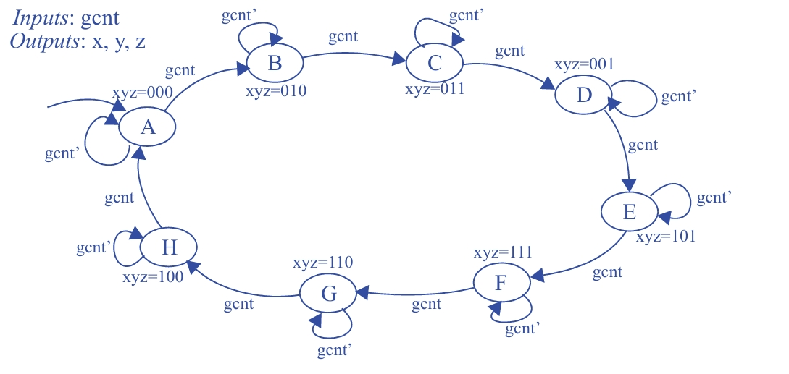

### Questão 3.29

Desenhe o diagrama de estados de uma FSM que possui uma entrada **gcnt** e três saídas **x, y, z**.  
As saídas `xyz` devem gerar uma sequência em **código Gray**, na qual **apenas um bit muda por vez**.  

A sequência exigida é: 000 → 010 → 011 → 001 → 101 → 111 → 110 → 100 → 000 → ...

A saída só deve mudar **na borda de subida do relógio** quando `gcnt = 1`.  
Quando `gcnt = 0`, a FSM deve manter o valor atual.  O estado inicial deve ser o que gera a saída **000**.

---

## Objetivo

- **Tarefa:** Projetar uma FSM que gere uma sequência de 8 códigos Gray de 3 bits.  
- **Entrada:** `gcnt` (habilita a contagem do código Gray).  
- **Saídas:** `x, y, z`.  
- **Estado inicial:** `xyz = 000`.

---

## Diagrama de Estados

---

## Etapa 1: Definição dos Estados e das Saídas

A forma mais direta de implementar um gerador de sequência é criar **um estado para cada valor distinto da sequência**.

- **Número de estados:** 8  
- **Tipo de FSM:** Máquina de **Moore**, pois as saídas dependem apenas do estado atual.

Os estados podem ser nomeados de **A a H**, com a seguinte associação:

| Estado | Saída (xyz) |
|------|-------------|
| A | 000 |
| B | 010 |
| C | 011 |
| D | 001 |
| E | 101 |
| F | 111 |
| G | 110 |
| H | 100 |

O enunciado exige que o estado inicial produza `000`, portanto o **Estado A** é o estado inicial da FSM.

---

## Etapa 2: Definição da Lógica de Transição

A entrada `gcnt` atua como um **sinal de habilitação da sequência**.

### Avanço na Sequência (`gcnt = 1`)
- Se `gcnt = 1`, a FSM avança para o próximo estado da sequência na próxima borda de subida do clock.
- No diagrama, isso é representado por setas entre estados consecutivos:
  - A → B → C → D → E → F → G → H → A
- Todas essas transições possuem a condição `gcnt`.

### Manutenção do Estado (`gcnt = 0`)
- Se `gcnt = 0`, a FSM **permanece no estado atual**, mantendo a mesma saída.
- No diagrama, isso é representado por **loops** em cada estado.
- Essas transições possuem a condição `gcnt'`.

---

## Etapa 3: Análise do Funcionamento

Seguindo o fluxo da FSM:

- A máquina inicia no **Estado A**, com `xyz = 000`.
- Se `gcnt = 0`, a FSM permanece em A (loop com `gcnt'`).
- Se `gcnt = 1`, na próxima borda de subida do clock, a FSM avança para o **Estado B**, produzindo `xyz = 010`.
- O mesmo comportamento se repete para todos os estados:
  - Com `gcnt = 1`, avança.
  - Com `gcnt = 0`, mantém o estado.
- Ao chegar ao **Estado H** (`xyz = 100`), se `gcnt = 1`, a FSM retorna ao **Estado A**, reiniciando a sequência.

---

## Conclusão

O diagrama de estados implementa corretamente um **gerador de código Gray de 3 bits**, garantindo que:

- Apenas **um bit muda por transição**, conforme a definição do código Gray.
- A sequência só avança quando `gcnt = 1`.
- O valor da saída é mantido quando `gcnt = 0`.
- O estado inicial é corretamente definido como `000`.

Essa abordagem, com um estado por valor da sequência, resulta em uma FSM simples, clara e fiel ao enunciado.
