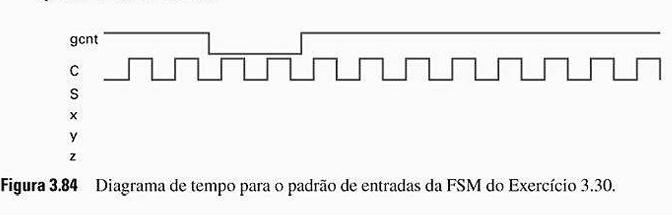
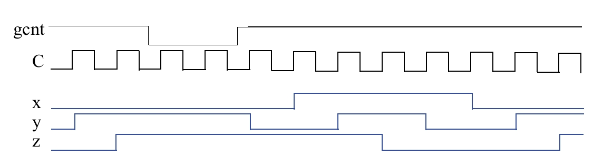

### Questão 3.30

Analise o funcionamento da FSM criada no **Exercício 29**, completando o **diagrama de tempo da Fig. 3.84**, em que **C** é a entrada de relógio e **S** é o registrador de estado de *n* bits.  
Assuma que **S é inicialmente 000**.

---

## Princípios de Funcionamento  
*(Regras da FSM da Questão 3.29)*

Para entender o diagrama de tempo, é necessário relembrar as regras da FSM analisada:

### Sequência de Saídas
A FSM possui **8 estados** (A a H), cada um produzindo uma saída `xyz`, na seguinte ordem:

    A: 000 → B: 010 → C: 011 → D: 001 →
    E: 101 → F: 111 → G: 110 → H: 100 → (retorna para A)

### Condição de Mudança
- A FSM **só muda de estado na borda de subida do clock C**.

### Controle de Habilitação
A entrada **gcnt** determina o comportamento da FSM:
- `gcnt = 1` → a FSM **avança** para o próximo estado da sequência.
- `gcnt = 0` → a FSM **permanece no estado atual**, mantendo a saída.

### Condição Inicial
- O estado inicial é **A**, portanto a saída começa em `xyz = 000`.

---

## Análise Passo a Passo do Diagrama de Tempo

A seguir, acompanha-se o estado da FSM e sua saída a cada borda de subida do clock.

### Início (Antes do 1º Pulso)
- A FSM está no estado inicial **A**.
- A saída `xyz` é **000**.

---

### Na 1ª Borda de Subida de C
- `gcnt = 1`
- **Ação:** Avançar.
- Transição: A → B  
- **Nova saída:** `xyz = 010`

---

### Na 2ª Borda de Subida de C
- `gcnt = 1`
- **Ação:** Avançar.
- Transição: B → C  
- **Nova saída:** `xyz = 011`

---

### Na 3ª Borda de Subida de C
- `gcnt = 1`
- **Ação:** Avançar.
- Transição: C → D  
- **Nova saída:** `xyz = 001`

---

### Na 4ª Borda de Subida de C
- `gcnt = 0`
- **Ação:** Manter.
- Estado permanece: D  
- **Saída:** `xyz = 001`

---

### Na 5ª Borda de Subida de C
- `gcnt = 0`
- **Ação:** Manter.
- Estado permanece: D  
- **Saída:** `xyz = 001`

---

### Na 6ª Borda de Subida de C
- `gcnt = 1`
- **Ação:** Avançar.
- Transição: D → E  
- **Nova saída:** `xyz = 101`

---

### Da 7ª à 12ª Borda de Subida
O sinal `gcnt` permanece em **1**, então a FSM continua avançando a cada pulso:

- **7ª borda:** E → F → `xyz = 111`
- **8ª borda:** F → G → `xyz = 110`
- **9ª borda:** G → H → `xyz = 100`
- **10ª borda:** H → A → `xyz = 000`
- **11ª borda:** A → B → `xyz = 010`
- **12ª borda:** B → C → `xyz = 011`

---

## Diagrama de Tempo

---

## Resumo do Comportamento

O diagrama de tempo mostra que a FSM se comporta como um **contador com sinal de habilitação (enable)**:

- Quando `gcnt = 1`, as saídas `x, y, z` avançam na sequência de **código Gray**, mudando a cada borda de subida do clock.
- Quando `gcnt = 0` (entre o 3º e o 6º pulso), a FSM **congela**, ignorando os pulsos de clock e mantendo o estado e a saída (`001`).
- Quando `gcnt` volta a `1`, a FSM retoma a contagem normalmente a partir do estado em que estava.
