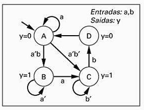
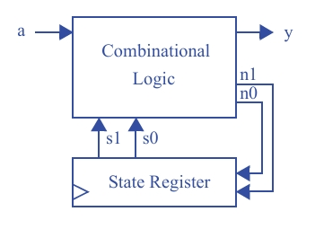
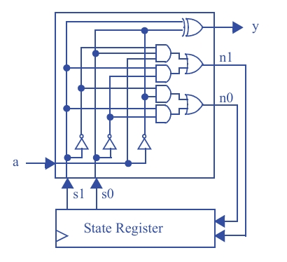

## Seção 3.4: Projeto de Bloco de Controle  
### Questão 3.39

Usando o **processo de cinco passos** para se projetar um bloco de controle, converta a **FSM da Fig. 3.87** em um bloco de controle. Implemente-o usando um **registrador de estado** e **portas lógicas**.

---

## O Objetivo

**Tarefa:** Converter a FSM da figura em um circuito físico (bloco de controle).  
**Componentes:**  
- **Registrador de Estado** para a memória  
- **Portas Lógicas** para o processamento (controle)

---

## Etapa 1: Capturar a FSM (A Definição do Problema)

Esta etapa, mostrada na **Fig. 3.87**, define o comportamento a ser implementado.

- **Entradas:** Um único bit `a`
- **Saídas:** Um único bit `y`
- **Estados:** Quatro estados nomeados **A**, **B**, **C** e **D**
- **Tipo de Máquina:** As saídas `y` estão associadas aos estados (círculos) e não às transições (setas). Portanto, é uma **Máquina de Moore**
- **Saída `y = 0`:** Estados **A** e **D**
- **Saída `y = 1`:** Estados **B** e **C**
- **Comportamento:** A máquina muda de estado com base na entrada `a`.  
  Exemplo: no estado **A**, se `a = 0`, ela vai para **B**; se `a = 1`, ela permanece em **A**.

---

## Etapa 2A: Montar a Arquitetura (O Modelo de Hardware)

Qualquer FSM pode ser construída com dois componentes principais:

### Registrador de Estado (*State Register*)
- É o coração da FSM, responsável por armazenar o **estado atual**
- Como existem **4 estados**, são necessários **2 bits** para representá-los  
  
  2^2 = 4
  
- Esses bits são as saídas do registrador: **s1** e **s0**

### Lógica Combinacional (*Combinational Logic*)
- É o “cérebro” do sistema
- **Entradas:**  
  - Estado atual (`s1`, `s0`)  
  - Entrada externa `a`
- **Saídas:**  
  - **Próximo estado** (`n1`, `n0`), carregado no registrador no próximo pulso de clock  
  - **Saída da FSM** (`y`)

---

## Etapa 2B: Codificar os Estados (Traduzindo Nomes para Bits)

O hardware não entende rótulos simbólicos como **A**, **B**, **C** e **D**.  
É necessário atribuir códigos binários únicos:

- **A = 00**
- **B = 01**
- **C = 10**
- **D = 11**

Assim:
- `s1s0 = 00` → Estado **A**
- `s1s0 = 01` → Estado **B**
- `s1s0 = 10` → Estado **C**
- `s1s0 = 11` → Estado **D**

---

## Etapa 2C: Preencher a Tabela-Verdade (O Mapa Completo)

Esta é a etapa mais crucial. A tabela-verdade descreve completamente o comportamento da **Lógica Combinacional**.  
Cada linha representa uma combinação possível do **estado atual** com a **entrada `a`**.

| s1 | s0 | a | n1 | n0 | y |
|----|----|---|----|----|---|
| 0  | 0  | 0 | 0  | 1  | 0 |
| 0  | 0  | 1 | 0  | 0  | 0 |
| 0  | 1  | 0 | 0  | 1  | 1 |
| 0  | 1  | 1 | 1  | 0  | 1 |
| 1  | 0  | 0 | 1  | 1  | 1 |
| 1  | 0  | 1 | 1  | 0  | 1 |
| 1  | 1  | 0 | 0  | 0  | 0 |
| 1  | 1  | 1 | 1  | 1  | 0 |

### Analisando como uma linha é preenchida

**Exemplo: Linha 3 (`s1 = 0`, `s0 = 1`, `a = 0`)**

- **Situação:**  
  Estado atual `s1s0 = 01` → **Estado B**, com entrada `a = 0`
- **Próximo Estado:**  
  No diagrama da FSM, a partir de **B** com `a'` (isto é, `a = 0`), a transição retorna para **B**  
  Código de **B** = `01` → `n1 = 0`, `n0 = 1`
- **Saída:**  
  No estado **B**, a saída é `y = 1`

Esse procedimento é repetido para todas as combinações possíveis, resultando na tabela completa.

---

## Etapa 2D: Implementar a Lógica Combinacional (Construindo o Cérebro)

### Derivar as Equações Booleanas
Para cada saída (`n1`, `n0` e `y`), deriva-se uma equação booleana a partir da tabela-verdade, somando os **mintermos** correspondentes às linhas onde a saída vale 1.

### Simplificar as Equações
A imagem mostra a simplificação da equação de `y`:

y = s_1's_0a' + s_1's_0a + s_1s_0'a' + s_1s_0'a

Fatorando:

y = s_1's_0(a' + a) + s_1s_0'(a' + a)

Como:

(a' + a) = 1

Temos:

y = s_1's_0 + s_1s_0'

### Desenhar o Circuito
O diagrama de circuito mostrado na imagem corresponde diretamente às equações finais:

- As entradas `a`, `s1` e `s0` são processadas pelas portas lógicas
- As saídas geradas são `n1`, `n0` e `y`
- As saídas `n1` e `n0` alimentam o **Registrador de Estado**, fechando o ciclo da FSM

---

## Circuito

