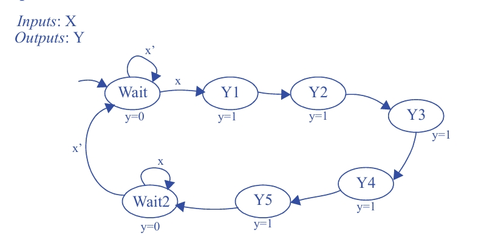
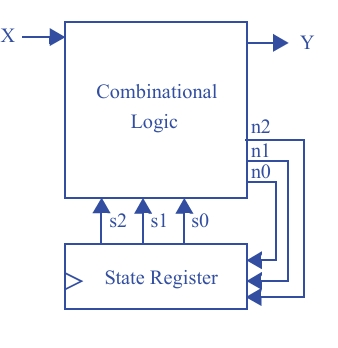

## Questão 3.44

Crie uma **FSM** que tenha uma entrada **X** e uma saída **Y**. Sempre que **X** mudar de 0 para 1, **Y** deverá ser 1 por **cinco ciclos de relógio** e então retornar a 0, mesmo que **X** ainda seja 1.  
Usando o **processo de cinco passos** para se projetar um bloco de controle, converta a FSM em um bloco de controle, **interrompendo o processo quando você criar a tabela de estados**.

---

## O Objetivo

**Tarefa:** Projetar uma FSM que detecta a **borda de subida** da entrada **X** (quando X vai de 0 para 1).  

**Comportamento:**  
Após detectar a borda, a saída **Y** deve ficar em **1 por exatamente cinco ciclos de relógio**. Depois disso, **Y deve voltar para 0**, mesmo que **X continue em 1**.  
A máquina só deve procurar por uma nova borda de subida **depois que X voltar a 0**.

---

## Etapa 1: Capturar a FSM (O Diagrama de Estados Correto)

Para atender a todos os requisitos, precisamos de uma FSM com **7 estados**:

- Um estado inicial para esperar a borda de subida  
- Cinco estados para contar os cinco ciclos do pulso de saída  
- Um estado final para esperar que a entrada seja liberada antes de recomeçar  

### Descrição dos Estados

- **Wait** *(Saída Y = 0)*:  
  Estado inicial. A FSM permanece aqui enquanto **X = 0**.  
  Quando **X sobe para 1**, a borda é detectada e a FSM avança.

- **Count1, Count2, Count3, Count4, Count5** *(Saída Y = 1)*:  
  Cadeia de cinco estados consecutivos.  
  A FSM passa **um ciclo de clock em cada estado**, mantendo **Y = 1**.  
  As transições entre eles são **incondicionais**.

- **WaitRelease** *(Saída Y = 0)*:  
  Após o quinto ciclo, a FSM entra neste estado.  
  A saída **Y volta para 0**.  
  A máquina permanece aqui enquanto **X = 1**, garantindo que o pulso não se repita.  
  Só retorna ao estado **Wait** quando **X = 0**.

### Diagrama de Estados Completo

---

## Etapa 2A: Montar a Arquitetura

A arquitetura de hardware para implementar a FSM é padrão:

- **Registrador de Estado:**  
  Armazena o estado atual.  
  Como temos **7 estados**, precisamos de **⌈log₂(7)⌉ = 3 bits** para representá-los.  
Logo, são necessários **3 flip-flops**, chamados **s2, s1 e s0**.

- **Lógica Combinacional:**  
  Recebe:
  - O estado atual (**s2, s1, s0**)  
  - A entrada **X**  

  Calcula:
  - O próximo estado (**n2, n1, n0**)  
  - A saída **Y**

---

## Etapa 2B: Codificar os Estados

Atribuímos códigos binários de 3 bits para cada estado:

| Estado        | Código Binário (s2 s1 s0) |
|---------------|---------------------------|
| Wait          | 000 |
| Count1        | 001 |
| Count2        | 010 |
| Count3        | 011 |
| Count4        | 100 |
| Count5        | 101 |
| WaitRelease   | 110 |
| (não usado)   | 111 |

---

## Etapa 2C: Criar a Tabela de Estados (Tabela-Verdade)

Esta é a **etapa final solicitada**.  
A tabela de estados especifica completamente o comportamento da **Lógica Combinacional**, listando o próximo estado e a saída para cada combinação de estado atual e entrada.

### Tabela de Estados

| Estado Atual (s2 s1 s0) | x | Próximo Estado (n2 n1 n0) | y |
|-------------------------|---|---------------------------|---|
| 000 (Wait)              | 0 | 000 (Wait)                | 0 |
| 000 (Wait)              | 1 | 001 (Count1)              | 0 |
| 001 (Count1)            | x | 010 (Count2)              | 1 |
| 010 (Count2)            | x | 011 (Count3)              | 1 |
| 011 (Count3)            | x | 100 (Count4)              | 1 |
| 100 (Count4)            | x | 101 (Count5)              | 1 |
| 101 (Count5)            | x | 110 (WaitRelease)         | 1 |
| 110 (WaitRelease)       | 0 | 000 (Wait)                | 0 |
| 110 (WaitRelease)       | 1 | 110 (WaitRelease)         | 0 |
| 111 (não usado)         | x | X X X (don’t care)        | x |

> **Nota:**  
> O símbolo **x** indica *don’t care* (não importa), pois a transição é incondicional ou o estado não é utilizado.

---

## Equações Lógicas Derivadas (Simplificadas)

A partir da tabela de estados, obtemos as equações da **Lógica Combinacional**:

### Próximo Estado

- **n2** = s1s0 + s2s0 + s2s1  
- **n1** = s2’s1’s0 + s2s0’ + s2s1x  
- **n0** = s2’s1’x + s2s1’s0’ + s1’s0  

### Saída

- **y** = s2’s0’ + s1s0’ + s2’s1  

---

## Circuito

---

## Explicação Final

Essas equações representam matematicamente o **“cérebro” da FSM**.  
A implementação física seria feita com:

- **3 flip-flops** para o registrador de estado  
- **Portas lógicas** (AND, OR, NOT) para implementar as equações de `n2`, `n1`, `n0` e `y`

O circuito resultante se comportaria exatamente como o diagrama de estados projetado, gerando um pulso de **5 ciclos** na saída **Y** sempre que uma **borda de subida** for detectada em **X**.
