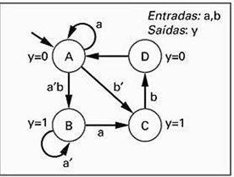
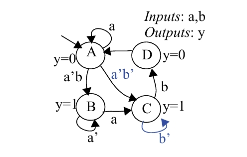

## Questão 3.45

A FSM da Fig. 3.89 tem dois problemas: há um estado que tem duas transições cujas condições podem ser verdadeiras ao mesmo tempo e há outros estados que têm transições sem haver garantia de que uma delas é verdadeira. Aplicando as operações OR e AND às condições das transições de cada estado, demonstre que de fato esses problemas existem. Então, conserte-os aperfeiçoando a FSM. Para tanto, faça o melhor que puder para tentar supor o que pretendeu o criador da FSM.

---

## O Problema: Identificando Falhas na FSM Original

O enunciado afirma que a FSM original (no topo da imagem) tem dois tipos de problemas:

- **Não Exclusividade:** Em um mesmo estado, as condições de duas ou mais transições podem ser verdadeiras ao mesmo tempo. A máquina não saberia qual caminho seguir.
- **Incompletude:** Em um mesmo estado, pode haver uma situação em que nenhuma condição de transição é verdadeira. A máquina ficaria "presa", sem saber o que fazer.

---

## Etapa 1: Análise do Estado A (Prova de Não Exclusividade)

**Regra:** Para verificar se duas transições são mutuamente exclusivas, aplicamos a operação **E (AND)** às suas condições. Se o resultado puder ser diferente de 0, significa que elas podem acontecer ao mesmo tempo, o que é um erro.

### Transições do Estado A:
- **Seta 1 (de A para A):** Condição = a  
- **Seta 2 (de A para B):** Condição = b'

### Teste Lógico (AND):
    a AND b' = ab'

**Conclusão:**  
O resultado é **ab'**. Esta expressão é verdadeira (1) se **a = 1** e **b = 0**. Como o resultado não é sempre 0, as condições não são exclusivas. Problema confirmado. Se a entrada fosse **a = 1, b = 0**, a FSM não saberia se deveria ficar em A ou ir para B.

---

## Etapa 2: Análise dos Estados B e C (Prova de Incompletude)

**Regra:** Para verificar se as transições de um estado são completas, aplicamos a operação **OU (OR)** a todas as suas condições de saída. Se o resultado não for sempre 1, significa que existe uma combinação de entradas para a qual nenhuma transição está definida.

### Transições do Estado B:
- **Seta 1 (de B para A):** Condição = a'
- **Seta 2 (de B para C):** Condição = a

### Teste Lógico (OR):
    a' OR a = a' + a = 1

**Conclusão:**  
O resultado é sempre 1. Isso significa que, para qualquer entrada, ou **a** ou **a'** será verdadeiro. Portanto, o Estado B está completamente especificado e não tem falhas.

---

### Transições do Estado C:
- **Seta 1 (de C para D):** Condição = b'

### Teste Lógico (OR):
Como só há uma condição, o resultado é simplesmente **b'**.

**Conclusão:**  
O resultado **b'** não é sempre 1. Se a entrada for **b = 1**, a condição **b'** será 0. Isso significa que se a FSM estiver no Estado C e a entrada **b** for 1, não há nenhuma transição definida. Problema de incompletude confirmado.  
(O mesmo vale para o Estado D, que não tem nenhuma transição de saída).

---

## Etapa 3: Corrigindo a FSM

A segunda parte da imagem mostra uma FSM corrigida. O objetivo é adivinhar a intenção do projetista e consertar os problemas, garantindo que todas as transições sejam exclusivas e completas para cada estado.

---

## Análise das Correções

### Correção para o Estado A:
A transição de A para B foi alterada de **b'** para **a'b**.

**Verificação:**  
Agora, as condições são **a** (para ficar em A) e **a'b** (para ir para B).

    b' AND b = 0 (exclusivas)
    b' OR b = 1 (completas)

O Estado C foi totalmente corrigido.

---

### Correção para o Estado D:
O Estado D não tinha nenhuma saída. Foram adicionadas duas:
- Uma transição de D para A com a condição **a**.
- Um loop de D para D com a condição **a'**.

**Verificação:**  
As condições são **a** e **a'**.

    a AND a' = 0 (exclusivas)
    a OR a' = 1 (completas)

O Estado D foi totalmente corrigido.

---

## FSM

---

## Conclusão

O diagrama final na imagem apresenta uma FSM funcional, onde cada estado tem um conjunto de transições de saída bem definido (**completo e exclusivo**) para todas as combinações de entrada possíveis.
