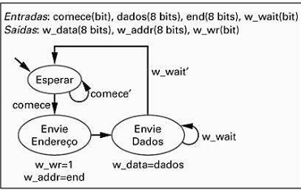

## Questão 5.10

(a) Use o método de projeto RTL da Tabela 5.1 para converter a máquina de estados de alto nível da Fig. 5.94 em um bloco de controle e um bloco operacional. Projete o bloco operacional em nível de estrutura, mas projete o bloco de controle apenas até o nível de FSM, como foi feito na Fig. 5.26.  

(b) *Projete a FSM do bloco de controle em nível de estrutura.

#### Fig. 5.26

#### Tabela 5.1

---

A solução divide o sistema em duas partes, exatamente como o método RTL exige: o **Datapath** (que faz as operações) e o **Controller** (que dá as ordens).

---

## Arquitetura de Bloco de Controle e Bloco Operacional

---

## O Bloco Operacional (Datapath) – O Diagrama da Direita

**O que é?**  
Este é o hardware que armazena e move os dados. Ele é a parte "muscular" do sistema.

### Componentes:

- **w_addrreg:**  
  Um registrador de 8 bits. Sua função é armazenar o endereço que será enviado ao barramento. Ele recebe o endereço da entrada externa `addr` (chamada de `end` no enunciado da questão) e o carrega quando o sinal de controle `w_addr_ld` é ativado.

- **w_datareg:**  
  Um registrador de 8 bits. Sua função é armazenar o dado que será enviado ao barramento. Ele recebe o dado da entrada externa `data` (chamada de `dados` no enunciado) e o carrega quando o sinal de controle `w_data_ld` é ativado.

### Saídas:

As saídas desses registradores (`w_addr` e `w_data`) são as saídas finais do sistema para o barramento.

Este datapath foi projetado corretamente para executar as ações de dados que a HLSM original pedia (basicamente, carregar um endereço e carregar um dado).

---

## O Bloco de Controle (Controller FSM) – O Diagrama da Esquerda

**O que é?**  
Esta é a Máquina de Estados Finitos (FSM) que funciona como o "cérebro" do sistema. Ela não manipula os dados de 8 bits, mas lê os sinais de 1 bit (`start`, `w_wait`) e gera os sinais de controle (`w_wr`, `w_addr_ld`, `w_data_ld`) para comandar o Datapath.

### Funcionamento (passo a passo):

#### Estado **Wait (Esperar)**  
Este é o estado inicial e de repouso.

- **Ação:**  
  Nenhuma ação é executada. As saídas de controle `w_wr`, `w_addr_ld` e `w_data_ld` estão todas em 0.

- **Transição:**  
  A FSM fica em loop neste estado enquanto `start = 0` (`start'`).  
  Quando `start` se torna 1, ela transiciona para o próximo estado.

#### Estado **Send Addr (Enviar Endereço)**

- **Ação:**  
  Ao entrar neste estado, a FSM ativa duas saídas:  
  - `w_wr = 1` (para sinalizar ao barramento que uma escrita vai começar)  
  - `w_addr_ld = 1` (para ordenar que o Datapath carregue o endereço no `w_addrreg`)

- **Transição:**  
  No próximo ciclo de clock, ela transiciona incondicionalmente para o estado **Send Data**.

#### Estado **Send Data (Enviar Dados)**

- **Ação:**  
  Neste estado, a FSM ativa `w_data_ld = 1`, ordenando ao Datapath que carregue os dados no `w_datareg`.

- **Transição:**  
  A FSM verifica a entrada `w_wait`.  
  - Se `w_wait = 1`, significa que o dispositivo externo ainda está ocupado, então a FSM fica em loop neste estado, mantendo os dados no barramento.  
  - Se `w_wait = 0` (`w_wait'`), significa que a operação foi concluída, e a FSM retorna ao estado **Wait**.

---

## Conclusão

A imagem mostra a implementação da parte (a) da Questão 5.10, onde a HLSM original foi dividida com sucesso em um **Bloco de Controle (Controller FSM)** e um **Bloco Operacional (Datapath)** que trabalham juntos para executar a tarefa. O Controller dá as ordens (`w_addr_ld`, `w_data_ld`) e o Datapath as executa.
