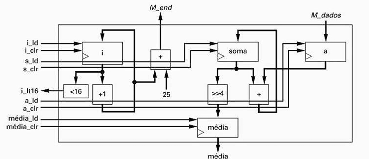

## Questão 5.11

Crie uma FSM que faz interface com o bloco operacional da Fig. 5.95. A FSM deve usar o bloco operacional para computar o valor médio dos 16 elementos de 32 bits de um array* A qualquer. Esse arranjo A é armazenado em uma memória, com o primeiro elemento no endereço 26, o segundo no endereço 27, e assim por diante. Assuma que, quando um novo valor é colocado nas linhas de endereço M_end, a memória coloca os dados lidos quase que imediatamente nas linhas de saída M_dados. Ignore a possibilidade de estouro.

---

## O Objetivo

**Tarefa:** Criar uma FSM (Bloco de Controle) para comandar o datapath da Fig. 5.95.  

**Função:** Fazer com que o datapath calcule a média de 16 elementos de 32 bits.  

**Interação com a Memória:** Os elementos estão em uma memória a partir do endereço 26. A FSM precisa gerar os endereços (M_end) e o datapath receberá os dados (M_dados).

---

## Etapa 1: Entendendo o Bloco Operacional (Datapath da Fig. 5.95)

Antes de criar o controle, precisamos entender as ferramentas que temos no datapath:

### Registradores

- **Registrador i:** Será nosso contador de loop (de 0 a 15).
- **Registrador a:** Irá guardar o endereço a ser enviado para a memória.
- **Registrador soma:** Irá acumular a soma dos 16 elementos.
- **Registrador média:** Irá guardar o resultado final.

### Componentes Aritméticos

- **+1:** Para incrementar o contador i.
- **+25:** Para calcular o endereço de memória (endereço = i + 25. Nota: A questão diz endereço 26, então i deve começar em 1, ou o valor a ser somado deveria ser 26). Vamos assumir que i vai de 0 a 15 e o endereço é i+26.
- **+:** Para somar o dado da memória à soma.
- **>>4:** Um deslocador de bits para a direita, que efetivamente divide a soma por 16 para calcular a média.

### Componente de Comparação

- **<16:** Um comparador que gera um sinal i_lt16 (i < 16), que será 1 enquanto o loop não terminar.

---

## Etapa 2: Definindo os Estados da FSM de Controle

Precisamos de uma sequência de estados para controlar o processo:

- **S_Init (Inicialização):** Zera todos os registradores para começar a operação.
- **S_FetchAddr (Buscar Endereço):** Calcula o endereço do próximo elemento do array na memória.
- **S_FetchData (Buscar Dado):** Espera um ciclo para a memória fornecer o dado (uma suposição comum).
- **S_Accumulate (Acumular):** Soma o dado lido ao acumulador soma e incrementa o contador i.
- **S_CalcAvg (Calcular Média):** Após o loop, calcula a média final.
- **S_Done (Fim):** Estado final de repouso.

---

## Etapa 3: A Máquina de Estados Finitos (FSM) do Bloco de Controle

Este é o diagrama de estados que atua como o "cérebro", enviando os sinais de controle corretos para o datapath em cada estado.

### Entradas para o Controle

- **start:** para iniciar  
- **i_lt16:** sinal de status do datapath

### Saídas do Controle

- **i_ld**
- **i_clr**
- **s_ld**
- **s_clr**
- **a_ld**
- **a_clr**
- **média_ld**

---

## Explicação do Fluxo e das Ações

### Estado S_Init (Inicialização)

- **Ação:**  
  O controle ativa os sinais de clear para zerar tudo:  
  `i_clr=1, s_clr=1, a_clr=1, média_clr=1`.

- **Transição:**  
  Após a limpeza, ele vai incondicionalmente para **S_FetchAddr** para começar a buscar o primeiro elemento.

---

### Estado S_FetchAddr (Buscar Endereço)

- **Ação:**  
  O controle ativa `a_ld=1` para carregar o registrador de endereço `a` com o valor de `i+26` (assumindo que o datapath está configurado para isso). O endereço é enviado para a memória via `M_end`.

- **Transição:**  
  Vai incondicionalmente para **S_FetchData** para aguardar o dado.

---

### Estado S_FetchData (Buscar Dado)

- **Ação:**  
  Nenhuma ação de escrita. O controle simplesmente espera um ciclo para que o dado da memória, `M_dados`, se estabilize na entrada do somador.

- **Transição:**  
  Vai incondicionalmente para **S_Accumulate**.

---

### Estado S_Accumulate (Acumular)

- **Ação:**  
  O controle ativa `s_ld=1` para somar o `M_dados` ao registrador soma, e também ativa `i_ld=1` para incrementar o contador i (`i := i+1`).

- **Transição:**  
  Verifica o sinal de status `i_lt16`.

  - Se `i_lt16 = 1`: O loop ainda não terminou. Volta para **S_FetchAddr** para buscar o próximo elemento.  
  - Se `i_lt16 = 0`: O loop terminou (todos os 16 elementos foram somados). Vai para **S_CalcAvg**.

---

### Estado S_CalcAvg (Calcular Média)

- **Ação:**  
  O controle ativa `média_ld=1` para carregar o registrador média com o valor de `soma >> 4`.

- **Transição:**  
  Vai incondicionalmente para o estado **S_Done**.

---

### Estado S_Done (Fim)

- **Ação:**  
  Nenhuma. A FSM fica em repouso aqui com o resultado final disponível na saída média.
