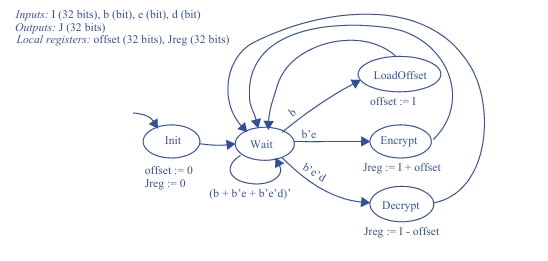

## Questão 5.2

Crie uma máquina de estados de alto nível para um dispositivo simples de encriptar e decriptar dados. Se uma entrada **b** de um bit for 1, o dispositivo armazenará os dados de uma entrada **I** de 32 bits como sendo o assim chamado valor de **offset**. Se **b = 0** e uma outra entrada **e** de um bit for 1, então o dispositivo “encriptará” sua entrada **I**, somando o valor armazenado de **offset** à essa entrada **I**, e colocará esse valor encriptado em uma saída **J** de 32 bits. Se, ao contrário, uma outra entrada **d** de um bit for 1, o dispositivo deverá “decriptar” os dados em **I**, subtraindo o valor de **offset**, antes de colocar o valor decriptado em **J**. Assegure-se de explicitamente levar em consideração todas as combinações possíveis dos três bits de entrada.

---

## Etapa 1: Análise dos Estados e Registradores

O projetista do diagrama definiu os seguintes componentes, que são necessários para resolver o problema:

### Registradores Locais:
- **offset (32 bits):** Para armazenar o valor de deslocamento, como pedido.
- **Jreg (32 bits):** Para armazenar o resultado do cálculo antes de enviá-lo para a saída **J**.

### Estados:
- **Init:** Um estado inicial para zerar os registradores, garantindo um começo limpo.
- **Wait:** O estado principal de "espera", onde a máquina aguarda por um comando.
- **LoadOffset:** O estado que executa a ação de carregar o valor de offset.
- **Encrypt:** O estado que executa a ação de encriptar (somar).
- **Decrypt:** O estado que executa a ação de decriptar (subtrair).

---

## Etapa 2: Verificando o Comportamento e as Transições

Agora, vamos verificar se as setas (transições) e as ações dentro dos estados correspondem ao que a questão pede. A lógica principal acontece a partir do estado **Wait**.

### Carregamento do Offset
> "Se a entrada **b** for 1, o dispositivo armazenará os dados de **I** ... como valor de offset."

- **No diagrama:**  
  Há uma seta saindo de **Wait** com a condição **b**, que leva ao estado **LoadOffset**.
- **Ação no estado:**  
    - offset := I
 
- **Conclusão:**  
O diagrama implementa isso corretamente.

---

### Encriptação
> "Se **b = 0** e **e = 1**, ... encriptará sua entrada **I**, somando o valor de offset..."

- **No diagrama:**  
Há uma seta saindo de **Wait** com a condição **b'e** (b = 0 e e = 1), levando ao estado **Encrypt**.
- **Ação no estado:**  
    - Jreg := I + offset
 
- **Conclusão:**  
O diagrama implementa isso corretamente.

---

### Decriptação
> "Se ... **d = 1**, o dispositivo deverá decriptar... subtraindo o valor de offset..."

- **No diagrama:**  
Há uma seta saindo de **Wait** com a condição **b'e'd** (b = 0, e = 0 e d = 1), levando ao estado **Decrypt**.
- **Ação no estado:**  
    - Jreg := I - offset

- **Conclusão:**  
O diagrama implementa isso corretamente.

---

## Etapa 3: Verificando Todas as Combinações de Entrada

A questão exige que todas as combinações das entradas **b**, **e** e **d** sejam tratadas. O diagrama faz isso de forma elegante, estabelecendo uma prioridade:

- **Se b = 1:**  
A máquina vai para **LoadOffset**, não importa o valor de **e** ou **d**.  
*(Condição: b)*

- **Se b = 0 e e = 1:**  
A máquina vai para **Encrypt**, não importa o valor de **d**.  
*(Condição: b'e)*

- **Se b = 0, e = 0 e d = 1:**  
A máquina vai para **Decrypt**.  
*(Condição: b'e'd)*

- **Se b = 0, e = 0 e d = 0:**  
Nenhuma das condições acima é satisfeita. A máquina segue a transição  
      (b + b'e + b'e'd)'

que simplifica para  
    b'e'd'

Esta é a condição para permanecer no estado **Wait**.

Essas quatro transições cobrem todas as **8 combinações possíveis** das 3 entradas de controle, garantindo que a máquina sempre saiba o que fazer.

Após cada ação (**LoadOffset**, **Encrypt** ou **Decrypt**), a máquina retorna **incondicionalmente** ao estado **Wait** para aguardar o próximo comando, o que também é um comportamento correto.

---

## Máquina de Estados

