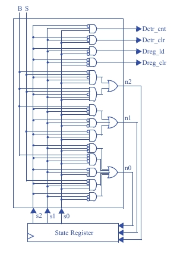

## Questão 5.23

### (a) Converta a FSM do medidor de distância baseado em laser, mostrada na Fig. 5.21, em um registrador de estado e lógica combinacional.  
### (b) Assumindo que todas as portas têm um atraso de 2 ns, o contador crescente de 16 bits tem um atraso de 5 ns e as conexões não têm atraso, determine o caminho crítico do medidor de distância baseado em laser.  
### (c) Calcule a correspondente frequência máxima de relógio para o circuito.

---

## Parte (a): Converter a FSM em um Circuito

O objetivo desta parte é traduzir a FSM (que é um diagrama abstrato, a Fig. 5.21, não fornecida aqui) em um circuito físico composto por um registrador de estado e lógica combinacional.

### Passo 1: A Tabela de Estados (Truth Table)

**O que ela representa?**  
Esta tabela é a especificação completa para o bloco de *Lógica Combinacional* da FSM. Ela descreve o que o circuito deve fazer para cada situação possível.

**Colunas de Entrada:**
- `s2, s1, s0`: Representam o estado atual da máquina, vindo do registrador de estado.  
- `a0, B, S`: São as entradas externas do sistema.

**Colunas de Saída:**
- `n2, n1, n0`: Representam o próprio estado para o qual a máquina deve transicionar no próximo ciclo de clock.  
- `Dreg_clr, Dreg_ld`, etc.: São os sinais de controle que a FSM envia para o datapath (o bloco operacional) para comandar as ações.

---

### Passo 2: As Equações Booleanas

**O que elas representam?**  
Cada equação é a tradução matemática de uma coluna de saída da tabela de estados. Por exemplo, a equação para `n2` descreve a lógica necessária para gerar o bit `n2` do próximo estado.

**Como são obtidas?**  
Essas equações são derivadas da tabela de estados, geralmente usando métodos de simplificação como Mapas de Karnaugh, para encontrar a forma mais eficiente (soma de produtos).

---

### Passo 3: O Circuito de Portas Lógicas

**Diagrama do circuito**

**O que ele representa?**  
É a implementação física, com portas lógicas (E, OU), das equações booleanas. Ele é o *“cérebro”* da FSM (o bloco de Lógica Combinacional).

**Como funciona?**  
Ele recebe como entrada o estado atual (`s2, s1, s0`) e as entradas externas (`B, S`) e calcula, através das portas, o próximo estado (`n2, n1, n0`) e os sinais de controle para o datapath. As saídas `n2, n1, n0` são então conectadas de volta às entradas do Registrador de Estado.

---

## Parte (b): Determinar o Caminho Crítico

O objetivo é encontrar o caminho com o maior atraso em todo o sistema (controlador + datapath).

### Atrasos Fornecidos:
- Atraso de cada porta lógica = **2 ns**  
- Atraso do contador de 16 bits (no datapath) = **5 ns**  
- Atraso das conexões (fios) = **0 ns**

### Análise:
- **Atraso do Controlador:**  
  O circuito do controlador (mostrado no diagrama de portas) tem dois níveis de portas em seu caminho mais longo (um nível de portas E alimentando um nível de portas OU).  

* Atraso do Controlador = 2 ns + 2 ns = 4 ns

- **Atraso do Datapath:**  
O enunciado nos diz que o componente mais lento no datapath é o contador de 16 bits, com um atraso de **5 ns**.

- **Comparação:**  
Comparamos o atraso máximo dentro do controlador (4 ns) com o atraso máximo dentro do datapath (5 ns).

**Conclusão:**  
O caminho mais longo, ou caminho crítico, é o do contador no datapath. Portanto, o atraso do caminho crítico do sistema é de **5 ns**.

---

## Parte (c): Calcular a Frequência Máxima de Relógio

A frequência máxima em que um circuito pode operar é o inverso do seu atraso de caminho crítico.

**Fórmula:**  

    Fmax = 1 / Tcrítico

**Cálculo:**  

    Tcrítico = 5 ns = 5 × 10⁻⁹ s
    Fmax = 1 / (5 × 10⁻⁹ s) = 200.000.000 Hz = 200 MHz

Esta é a velocidade máxima de clock que o medidor de distância pode usar de forma confiável.
