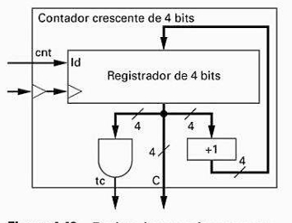

## Questão 5.7

Compare o contador crescente projetado no Exercício 5.6 com projetado na Fig. 4.48.

---

## Análise dos Dois Projetos

### Contador do Exercício 5.6 (Nosso Projeto RTL)

**Metodologia:**  
Segue o método de projeto RTL, com uma separação clara entre:

- **Bloco Operacional (Datapath):** Contém um registrador, um incrementador (+1), um MUX e um comparador. É a parte que efetivamente armazena e manipula os dados.  
- **Bloco de Controle (Controller):** Contém a lógica (portas lógicas) que interpreta as entradas (cnt, clr) e comanda o datapath (através dos sinais ld_count, sel_clr).

**Funcionalidades:**
- **Contagem (cnt = 1):** Incrementa o valor armazenado.  
- **Manutenção (cnt = 0):** Mantém o valor armazenado.  
- **Limpeza Síncrona (clr = 1):** Força o valor armazenado a ser 0000. Esta é uma funcionalidade extra e muito importante.  
- **Término da Contagem (tc):** Usa um comparador para indicar quando a contagem atinge 15.

---

### Contador da Figura 4.48 (Projeto Integrado)

**Metodologia:**  
É um projeto mais direto e integrado. Não há uma separação explícita entre datapath e controle. A entrada de controle cnt atua diretamente como o sinal de habilitação (ld) do registrador.

**Funcionalidades:**
- **Contagem (cnt = 1):** O registrador é habilitado para carregar o próximo valor, que é o valor atual + 1.  
- **Manutenção (cnt = 0):** O registrador é desabilitado e mantém seu valor.  
- **Limpeza Síncrona (clr = 1):** Não possui esta função. Não há uma entrada clr ou um mecanismo para zerar o contador.  
- **Término da Contagem (tc):** Usa uma porta E (AND) de 4 entradas. A saída tc só será 1 quando todas as quatro saídas do registrador forem 1 (ou seja, 1111, que é 15). Esta é uma forma eficiente de detectar o valor máximo.

---

## Tabela Comparativa

| Característica | Contador do Exercício 5.6 (RTL) | Contador da Figura 4.48 (Integrado) |
|---------------|----------------------------------|-------------------------------------|
| Função Principal | Contador crescente síncrono de 4 bits | Contador crescente síncrono de 4 bits |
| Sinais de Entrada | cnt (contagem), clr (limpar) | cnt (contagem) |
| Sinais de Saída | count (saída de 4 bits), tc (término da contagem) | c (saída de 4 bits), tc (término da contagem) |
| Função de “Clear” | Sim. Possui uma entrada clr para zerar o contador de forma síncrona | Não. Não há como zerar o contador através de controle externo |
| Geração de tc | Usa um bloco comparador que verifica se count == 15 | Usa uma porta E (AND) de 4 entradas para verificar se c == 1111 |
| Metodologia | RTL (Datapath + Controle), separando lógica de controle das operações com dados | Estrutura integrada. Design mais simples, onde o controle está diretamente “embutido” no datapath |
| Complexidade | Maior. Inclui um MUX e lógica de controle dedicada | Menor. Implementação mais minimalista da função de contagem |

---

## Conclusão

O contador projetado no Exercício 5.6 é mais completo e versátil, pois inclui a funcionalidade essencial de limpeza (clear/reset). A metodologia RTL usada é mais robusta e escalável para projetar sistemas mais complexos.

O contador da Figura 4.48 é mais simples e minimalista. Ele executa a função de contagem de forma eficiente, mas lhe falta a flexibilidade de ser zerado, o que pode ser uma limitação em sistemas maiores.
