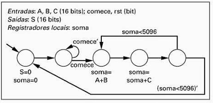

## Questão 5.8

Crie um bloco operacional para a máquina de estados de alto nível da Fig. 5.93.

O objetivo é projetar o hardware (registradores, somadores, multiplexadores, etc.) que pode executar todas as operações com dados descritas no diagrama da FSM. O bloco operacional é a parte do sistema que "faz as contas", enquanto um bloco de controle (que não precisamos projetar aqui) lhe diria quando fazer cada conta.

---

## Etapa 1: Identificar Todas as Operações de Dados da HLSM

Primeiro, listar todas as ações e condições da FSM que manipulam dados:

### Armazenamento de Dados:
- O sistema precisa de um registrador local para guardar o valor da soma.

### Operações Aritméticas:
- O sistema precisa calcular A + B.  
- O sistema precisa calcular soma + C.

### Carregar Valores (Atribuições):
- O registrador soma precisa ser carregado com o valor 0 (soma = 0).  
- O registrador soma precisa ser carregado com o resultado de A + B.  
- O registrador soma precisa ser carregado com o resultado de soma + C.

### Operações de Comparação:
- O sistema precisa verificar a condição soma < 5096 para decidir a próxima transição.

### Geração de Saídas:
- O sistema precisa gerar a saída S. A FSM específica S = 0 no estado inicial. Uma suposição razoável é que a saída S deve refletir o valor atual da soma nos outros estados. Vamos assumir que S = soma.

---

## Etapa 2: Selecionar os Componentes para o Bloco Operacional

Agora, selecionamos os componentes de hardware necessários para realizar cada uma das operações listadas.

### Para o armazenamento:
- Um Registrador de 16 bits com um sinal de habilitação de carga (soma_ld). Ele irá armazenar o valor de soma.

### Para a aritmética:
- Precisamos de um somador para A + B e outro para soma + C. Usaremos, portanto, dois Somadores (Adders) de 16 bits.

### Para a seleção de dados:
- A entrada do registrador soma precisa vir de três fontes diferentes (0, A + B, ou soma + C). Um Multiplexador (MUX) 4-para-1 de 16 bits é ideal para selecionar qual valor será carregado. Ele será controlado por um sinal de seleção de 2 bits, soma_sel[1..0].

### Para a comparação:
- Precisamos de um Comparador de Magnitude de 16 bits. Ele irá comparar a saída do registrador soma com a constante 5096 e produzir um sinal de 1 bit, soma_lt_5096 (soma less than 5096).

### Para a saída:
- A saída S será conectada diretamente à saída do registrador soma.

---

## Etapa 3: O Diagrama do Bloco Operacional (Datapath)

Juntando todos os componentes, o bloco operacional fica assim. Note os sinais de controle (setas que entram nos componentes, vindas do "Bloco de Controle" imaginário) e os sinais de status (setas que saem do datapath para o "Bloco de Controle").

### Como o circuito funciona:
- O Bloco de Controle (não mostrado) observa o estado atual e as entradas (comece, rst, e o sinal de status soma_lt_5096).
- Com base nisso, ele gera os sinais de controle soma_ld e soma_sel.
- Para calcular soma = A + B: O controle define soma_sel = 01 (para selecionar a saída do primeiro somador) e soma_ld = 1 (para carregar o valor no registrador).
- Para calcular soma = soma + C: O controle define soma_sel = 10 (para selecionar a saída do segundo somador) e soma_ld = 1.
- Para zerar a soma: O controle define soma_sel = 00 (para selecionar a entrada 0) e soma_ld = 1.
- O Comparador informa continuamente ao controle se a condição soma < 5096 é verdadeira, para que ele possa decidir a próxima transição.
- A Saída S sempre mostra o valor atual que está guardado no registrador soma.
