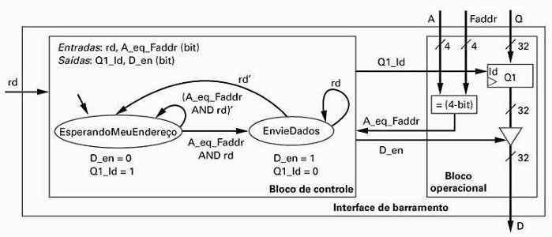
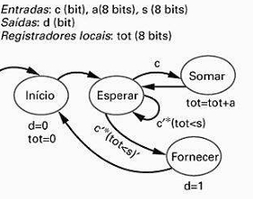
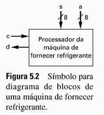

## Questão 5.9

*Começando com o projeto da máquina de fornecer refrigerante do Exemplo 5.1, crie um diagrama de blocos e uma máquina de estados de alto nível para uma máquina de fornecer refrigerante. Essa permite escolher entre dois tipos de refrigerante e também fornece troco ao consumidor. Um detector de moedas fornece ao circuito um sinal m de um bit que torna-se 1 durante um ciclo de relógio, quando uma moeda é detectada, e também a quantia v de oito bits, com o valor da moeda em centavos. Duas entradas r1 e r2 de oito bits indicam o custo dos dois tipos de refrigerante que podem ser escolhidos. A escolha de refrigerante do usuário é controlada por dois botões b1 e b2 que, quando pressionados, ficam em 1 durante um ciclo de relógio. Se o usuário tiver colocado moedas suficientes para o refrigerante escolhido, então o circuito colocará um dos bits de saída f1 ou f2 em 1 durante um ciclo de relógio, o que levará a máquina a fornecer o refrigerante escolhido. Se for necessário troco, o circuito da máquina de fornecer refrigerante colocará um bit nt em 1 durante um ciclo de relógio e também indicará na saída vt de oito bits o valor necessário do troco. Usando o método de projeto RTL mostrado na Tabela 5.1, converta a máquina de estados de alto nível em um bloco de controle e um bloco operacional. Projete o bloco operacional até o nível de estrutura, mas projete o bloco de controle até o nível de FSM apenas, como foi feito na Fig. 5.26.*

### Exemplo 5.1

---

## Etapa 1: Criar a Máquina de Estados de Alto Nível (HLSM)

A HLSM é um diagrama de estados que descreve o comportamento do sistema de forma abstrata, focando nas ações e transições, sem se preocupar com os componentes de hardware.

### Componentes da HLSM:

**Entradas:**  
- m  
- v (valor da moeda)  
- r1, r2 (preços)  
- b1, b2 (botões)

**Saídas:**  
- f1, f2 (liberar refri)  
- nt (necessita troco)  
- vt (valor do troco)

**Registradores Internos:**  
- Precisamos de um para acumular o dinheiro.  
- **Total (8 bits):** Armazena a soma das moedas inseridas.

### Diagrama da HLSM:

O comportamento pode ser dividido nos seguintes estados:

- **Wait (Esperando):**  
  O estado inicial e de repouso. Espera por uma moeda (m=1) ou que um botão (b1 ou b2) seja pressionado.

- **AddCoin (Adicionar Moeda):**  
  Quando uma moeda é inserida, este estado atualiza a soma.  
  Ação: `total := total + v`.

- **CheckS1 / CheckS2 (Verificar Saldo):**  
  Quando um botão é pressionado, este estado compara o total com o preço do refrigerante correspondente.

- **Dispense1 / Dispense2 (Liberar Refri):**  
  Se o saldo for suficiente, este estado ativa a liberação do refrigerante e calcula o troco.  
  Ação: `f1 := 1; vt := total - r1;`.

- **GiveChange (Dar Troco):**  
  Ativa a saída do troco.  
  Ação: `nt := 1`.

- **ResetTotal (Zerar Total):**  
  Zera o total e volta ao estado de espera.  
  Ação: `total := 0`.

---

## Etapa 2: Projetar o Bloco Operacional (Datapath)

O datapath é o conjunto de hardware que executa todas as operações com dados (armazenar, somar, subtrair, comparar) definidas na HLSM.

### Componentes Necessários:

- **Registrador total:**  
  Um registrador de 8 bits com habilitação de carga (total_ld) para armazenar o valor depositado.

- **Somador:**  
  Para calcular `total + v`.

- **Subtratores:**  
  Dois subtratores para calcular o troco:  
  - `total - r1`  
  - `total - r2`

- **Comparadores:**  
  Dois comparadores para verificar o saldo:  
  - `total >= r1`  
  - `total >= r2`

- **Multiplexadores (MUXes):**  
  - Um MUX na entrada do registrador total para selecionar o que será carregado (seja 0, total + v, ou o valor atual para manter).  
  - Um MUX na saída vt para selecionar qual valor de troco (`total - r1` ou `total - r2`) deve ser enviado.

### Interface com o Bloco de Controle:

- **Sinais de Controle (do Controle para o Datapath):**  
  - total_ld  
  - total_sel  
  - vt_sel

- **Sinais de Status (do Datapath para o Controle):**  
  - total_ge_r1  
  - total_ge_r2

---

## Etapa 3: Projetar o Bloco de Controle (FSM)

Esta é a etapa final solicitada. O bloco de controle é uma FSM mais simples que lê as entradas externas e os sinais de status do datapath para gerar os sinais de controle que comandam o datapath. Os estados são os mesmos da HLSM.

### Como ler o diagrama do controle:

- Em cada estado (círculo), são mostrados os sinais de saída que o controle ativa.  
  Por exemplo, no estado **AddCoin**, ele ativa `total_ld = 1` e `total_sel = 01` para que o datapath some o valor da moeda ao total.

- Nas transições (setas), são mostradas as condições de entrada que causam a mudança de estado.  
  Por exemplo, para sair do estado **Wait**, é preciso que `m = 1` ou `b1 = 1` ou `b2 = 1`.  
  Para sair do estado **CheckS1**, a FSM olha para a entrada de status `total_ge_r1` (que vem do comparador no datapath).
