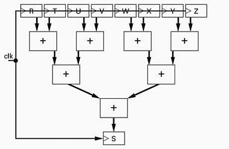
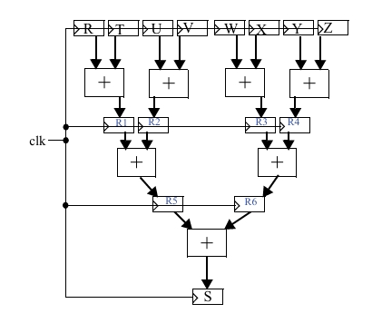
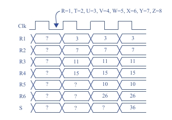

## Seção 6.5: Otimizações e Tradeoffs em Projeto RTL

### Questão 6.32

A árvore de somadores mostrada na Fig. 6.94 é usada para computar a soma de oito entradas a cada ciclo de relógio, em que a soma é  
S = R + T + U + V + W + X + Y + Z.

### (a) Projete uma versão pipeline da árvore de somadores para maximizar a velocidade com a qual podemos operar a entrada clk de relógio.

### (b) Crie um diagrama de tempo

---

## O Problema: A Limitação do Circuito Original (Fig. 6.94)

O circuito original, mostrado na sua terceira imagem, é uma "árvore de somadores". Para calcular a soma final S, um sinal precisa passar por três níveis de somadores em sequência.

**Caminho Crítico:**  
O caminho mais longo que um sinal percorre é da entrada (ex: R) até a saída (S). Esse caminho passa por três somadores.

**Atraso:**  
Se cada somador tem um atraso de 3 ns (conforme mencionado nas partes c e d da questão), o atraso total do circuito original é  
3 somadores × 3 ns/somador = 9 ns.

**Consequência:**  
Como o circuito precisa de 9 ns para garantir que o resultado esteja correto, a frequência máxima do relógio (clk) é limitada a  
1 / 9 ns ≈ 111 MHz.  
Para obter resultados mais rápidos, precisamos de um design melhor.

---

## Parte (a): Projetando a Versão Pipeline

A técnica usada é o **pipelining**.

### Passo 1: Entender o Conceito de Pipelining

A ideia é quebrar o longo caminho de 9 ns em pedaços menores, inserindo registradores (flip-flops) entre os estágios de lógica. Com isso, o relógio não precisa mais esperar 9 ns, mas apenas o tempo do pedaço mais longo entre dois registradores.

### Passo 2: Aplicar o Pipelining ao Circuito

O projetista quebrou o caminho de três somadores em três estágios de um somador cada:

- **Inserção dos Primeiros Registradores (R1, R2, R3, R4):**  
  Após o primeiro nível de somadores, são colocados quatro registradores. Isso cria o primeiro estágio do pipeline. Agora, o relógio só precisa esperar o tempo de um somador (3 ns) para que os resultados parciais sejam armazenados nesses registradores.

- **Inserção dos Segundos Registradores (R5, R6):**  
  Após o segundo nível de somadores, são colocados mais dois registradores, criando o segundo estágio.

- **Registrador de Saída (S):**  
  O registrador S, que já existia, serve como o registrador do último estágio.

**Resultado:**  
O caminho mais longo entre quaisquer dois registradores (ou entre a entrada e o primeiro registrador) é agora o atraso de apenas um somador (3 ns). Isso significa que o novo circuito pode operar com um período de relógio de 3 ns, ou uma frequência de  
1 / 3 ns ≈ 333 MHz, um aumento de 3x na velocidade!

#### pipelining

---

## Parte (b): Análise do Diagrama de Tempo

O diagrama de tempo para o novo circuito pipeline. Ele ilustra como os dados fluem através dos estágios a cada pulso do relógio.

### Análise do Fluxo (passo a passo):

**Antes do 1º Pulso:**  
Todas as saídas dos registradores (R1 a S) são desconhecidas (?). As entradas R a Z são aplicadas.

**Na 1ª Borda de Subida do Clock:**  
O primeiro nível de somadores termina seu cálculo.  
Os registradores R1, R2, R3, R4 "fotografam" esses resultados:  
- R1 <= R+T = 1+2 = 3  
- R2 <= U+V = 3+4 = 7  
- R3 <= W+X = 5+6 = 11  
- R4 <= Y+Z = 7+8 = 15  

Os outros registradores (R5, R6, S) ainda recebem valores desconhecidos, então suas saídas continuam ?.

**Na 2ª Borda de Subida do Clock:**  
O segundo nível de somadores termina seu cálculo, usando os valores agora estáveis de R1 a R4.  
Os registradores R5 e R6 "fotografam" esses novos resultados:  
- R5 <= R1+R2 = 3+7 = 10  
- R6 <= R3+R4 = 11+15 = 26  

O registrador S ainda não tem um resultado válido.  
(Ao mesmo tempo, os registradores R1–R4 re-capturam os resultados do primeiro nível de soma, que continuam os mesmos pois as entradas R–Z não mudaram).

**Na 3ª Borda de Subida do Clock:**  
O terceiro e último nível de somadores termina seu cálculo, usando os valores estáveis de R5 e R6.  
O registrador final S "fotografa" o resultado final da soma:  
- S <= R5+R6 = 10+26 = 36
