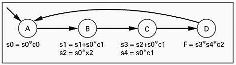
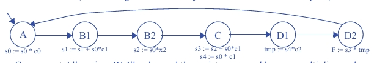
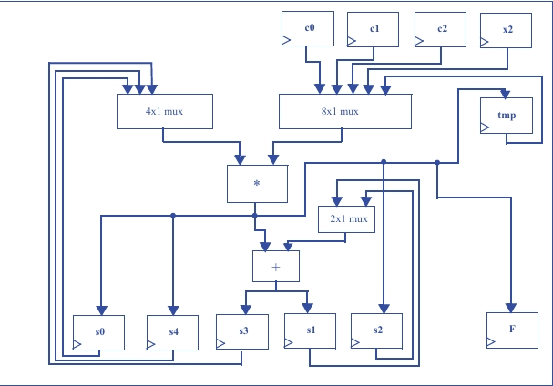
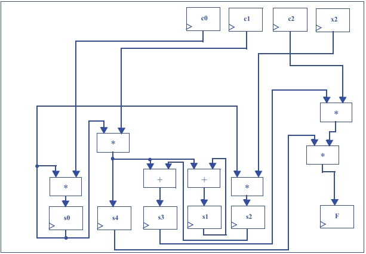

# Questão 6.39

Dada a máquina de estados de alto nível da Fig. 6.95, crie dois projetos diferentes: um otimizado para apresentar um atraso mínimo e o outro, para um tamanho mínimo de circuito. Assegure-se claramente indicar a alocação dos componentes e o mapeamento e o escalonamento dos operadores que forem usados para projetar os dois circuitos.

---

## Entendendo o Problema (HLSM da Fig. 6.95)

Primeiro, vamos analisar a Máquina de Estados de Alto Nível (HLSM) original. Ela descreve uma sequência de cálculos divididos em 4 estados (A, B, C, D). O desafio é que alguns estados, como o B, realizam múltiplas operações aritméticas.

**O Balanço Principal (Trade-off):**

- Para ser **RÁPIDO**: Precisamos de hardware dedicado para fazer todas as operações de um estado ao mesmo tempo, em paralelo. Isso custa mais "espaço" no chip.  
- Para ser **PEQUENO**: Usamos o mínimo de componentes caros (como multiplicadores e somadores) e os reutilizamos ao longo de vários ciclos de clock. Isso economiza espaço, mas torna o processo mais lento.

---

## Projeto 1: Otimizado para Tamanho Mínimo de Circuito

**Novo Diagrama de Estados:**

### Passo 1: Escalonamento (Scheduling) - Usando Mais Tempo

- A Estratégia: A ideia é usar apenas um multiplicador e um somador para todo o circuito. Como não podemos fazer todas as operações ao mesmo tempo, quebramos as operações complexas da HLSM original em mais estados, cada um executando uma única tarefa.

- O Novo Diagrama de Estados: A resposta mostra um novo diagrama com mais estados (A, B1, B2, C, D1, D2).

    - As operações do estado B original são divididas: B1 faz a soma e B2 faz a multiplicação.

    - A operação final em D também é dividida em dois ciclos: D1 faz uma multiplicação e armazena em um registrador temporário (tmp), e D2 faz a soma final.

    - Este novo "escalonamento" leva mais ciclos de clock para terminar, mas permite que usemos o mesmo hardware repetidamente.

### Passo 2: Alocação de Componentes - Mínimo de Hardware

Conforme a estratégia, alocamos o mínimo de hardware aritmético:

  - 1 Multiplicador  
  - 1 Somador  

Para permitir que esses componentes sejam reutilizados, precisamos de Multiplexadores (MUXes), que funcionam como chaves para direcionar os dados corretos para as entradas do somador e do multiplicador a cada ciclo de clock.

### Passo 3: Mapeamento (Binding) e o Datapath Final

**Diagrama do datapath:**

O diagrama do datapath na imagem mostra essa estratégia em ação:

- **Multiplicador Único:** Veja como as entradas do único multiplicador (*) vêm de dois grandes MUXes (um 4x1 e um 8x1). Um bloco de controle (não mostrado) usaria esses MUXes para escolher quais operandos (s0, c0, s4, c2, etc.) seriam multiplicados em cada estado.  
- **Somador Único:** Da mesma forma, a entrada do somador (+) pode receber o valor de s1 ou s2, permitindo que ele seja usado em diferentes momentos.

**Conclusão do Projeto 1:**  
Este é um design lento, porém compacto. Ele economiza área no chip ao reutilizar os caros blocos de soma e multiplicação, ao custo de precisar de mais ciclos de clock para completar a tarefa.

---

## Projeto 2: Otimizado para Velocidade Máxima

Esta abordagem prioriza a velocidade, sem se preocupar com o custo em área.

**Diagrama de Estados:**

### Passo 1: Escalonamento (Scheduling) - Usando Menos Tempo

A Estratégia: Executar o máximo de operações possível em paralelo em cada ciclo de clock para terminar a tarefa no menor número de ciclos.

O Novo Diagrama de Estados: O diagrama de estados é reduzido para apenas três estados (A → B → D).

- No estado A, duas multiplicações são feitas ao mesmo tempo.  
- No estado B, três operações (+, +, *) são feitas ao mesmo tempo.  
- No estado D, duas multiplicações (*, *) são feitas ao mesmo tempo para gerar a saída F.

### Passo 2: Alocação de Componentes - Máximo de Hardware

- Para permitir o paralelismo massivo, alocamos hardware dedicado para quase todas as operações.

- A resposta menciona o uso de múltiplos multiplicadores e somadores dedicados. O datapath mostra claramente essa duplicação de recursos.

### Passo 3: Mapeamento (Binding) e o Datapath Final

**Diagrama do datapath:**

O diagrama do datapath na segunda imagem reflete essa filosofia:

- **Múltiplos Multiplicadores e Somadores:** Observe que existem quatro multiplicadores e dois somadores desenhados. Cada um tem uma função específica e dedicada (ex: um multiplicador só para s0*c0, outro só para s0*x2, etc.).  
- **Ausência de MUXes de Compartilhamento:** Não há grandes MUXes para compartilhar recursos. As conexões são diretas: a saída de um registrador vai para a entrada do seu operador dedicado, e a saída deste vai para o próximo registrador.

**Conclusão do Projeto 2:**  
Este é um design rápido, porém grande e caro. Ele atinge o desempenho máximo ao duplicar os recursos de hardware, permitindo que muitas operações ocorram em paralelo e reduzindo o número de ciclos de clock necessários.
